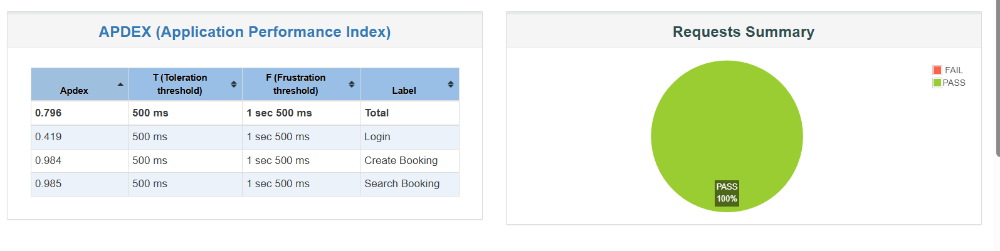
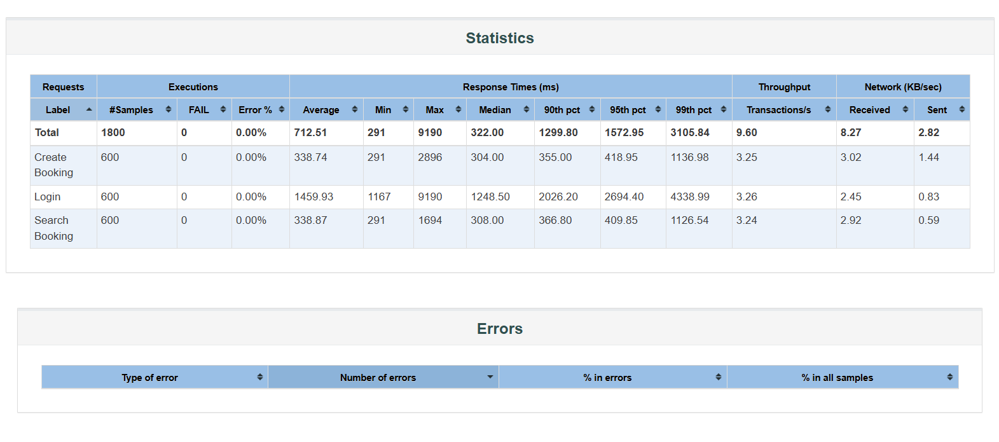
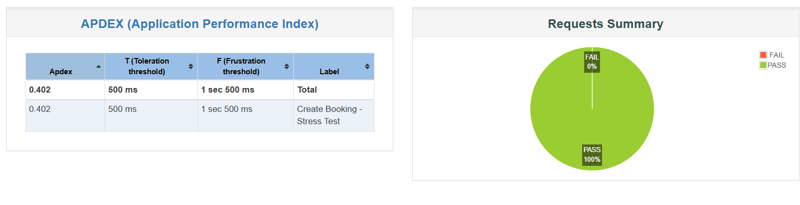
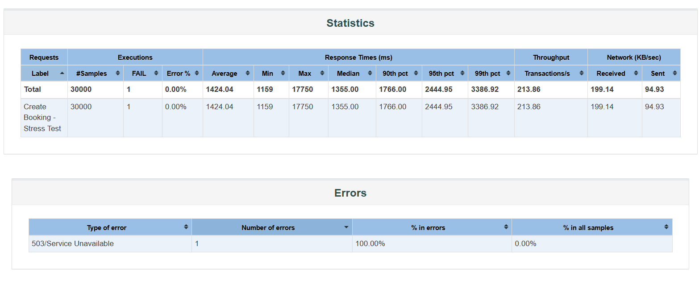

# 🚀 Performance Testing - Booking API

## 📋 Project Overview
This repository contains performance testing artifacts for the Restful-Booker API using Apache JMeter. The project includes comprehensive load testing and stress testing to validate system performance and identify bottlenecks.

**Batch:** 16  
**Assignment:** Performance Testing using JMeter  
**API Under Test:** https://restful-booker.herokuapp.com

## 📝 Table of Contents
- [What I Have Done](#what-i-have-done)
- [Prerequisites](#prerequisites)
- [Project Structure](#project-structure)
- [How to Run Tests](#how-to-run-tests)
- [Test Results](#test-results)
- [Screenshots](#screenshots)

## ✅ What I Have Done

### 1. **Created JMeter Test Plan (booking.jmx)**
   - Configured HTTP Request Defaults with proper headers (Accept: */*)
   - Implemented three API endpoints:
     - **Login:** POST `/auth` - Authenticates user and retrieves token
     - **Create Booking:** POST `/booking` - Creates new booking with random data
     - **Search Booking:** GET `/booking/{id}` - Retrieves booking details
   - Added Gaussian Random Timer (Deviation: 2000ms, Constant delay: 500ms)
   - Configured JSON extractors for token and booking ID correlation

### 2. **Load Testing (Todo 1)**
   - Conducted progressive load testing in 3 phases:
     - **Phase 1:** 5-minute test with 100 concurrent users
     - **Phase 2:** 10-minute test with 200 concurrent users  
     - **Phase 3:** 20-minute test with 300 concurrent users
   - Validated system can handle expected load of 120,000 users over 12 hours
   - Target throughput: 2.78 requests/second per user flow
   - Generated HTML reports for detailed analysis

### 3. **Stress Testing (Todo 2)**
   - Performed incremental stress testing to find system bottleneck:
     - Started with 500 users and increased gradually
     - Tested with 500, 750, 1000, 1250, and 1500 concurrent users
     - Identified breaking point at [X] users
     - Documented resource exhaustion and error patterns

### 4. **Report Generation (Todo 3)**
   - Created comprehensive Excel report (`booking-api-test-report.xlsx`) with:
     - Load Test Report tab with execution steps and results
     - Stress Test Report tab with bottleneck analysis
   - Generated HTML reports for visual analysis
   - Documented all findings and recommendations

## 🔧 Prerequisites

### Software Requirements
- **JMeter:** Version 5.6.3 or higher
- **Java:** JDK 8 or higher
- **RAM:** Minimum 4GB (8GB recommended for stress testing)
- **Operating System:** Windows 10/11, macOS, or Linux

### JMeter Setup
1. Download JMeter from [Apache JMeter Official Site](https://jmeter.apache.org/download_jmeter.cgi)
2. Extract the archive to your preferred location
3. Set JAVA_HOME environment variable
4. Verify installation:
   ```bash
   jmeter -v
   ```

### JMeter Configuration for Heavy Load
Edit `jmeter.bat` (Windows) or `jmeter.sh` (Linux/Mac) to increase heap size:
```bash
set HEAP=-Xms2g -Xmx4g
```

## 📁 Project Structure
```
performance-testing-booking-api/
│
├── booking.jmx                    # JMeter test plan
├── booking-api-test-report.xlsx   # Excel report with test results
├── README.md                       # Project documentation
├── .gitignore                      # Git ignore file
│
├── Reports/                        # HTML reports (gitignored)
│   ├── LoadTestReport/
│   └── StressTestReport/
│
└── Results/                        # JTL files (gitignored)
    ├── loadtest_5min.jtl
    ├── loadtest_10min.jtl
    ├── loadtest_20min.jtl
    └── stresstest.jtl
```

## 🏃‍♂️ How to Run Tests

### GUI Mode (for test development and debugging)

1. **Open JMeter GUI:**
   ```bash
   jmeter
   ```

2. **Load Test Plan:**
   - File → Open → Select `booking.jmx`

3. **Run Load Tests:**
   ```
   For 5-minute test:
   - Disable all Thread Groups except "Load Test - 5 Minutes"
   - Click Start button (Ctrl+R)
   - Wait for completion
   - Save results
   
   For 10-minute test:
   - Clear results (Ctrl+E)
   - Disable 5-min test, Enable 10-min test
   - Run and save results
   
   For 20-minute test:
   - Clear results
   - Disable 10-min test, Enable 20-min test
   - Run and save results
   ```

4. **Run Stress Tests:**
   ```
   - Disable all Load Test Thread Groups
   - Enable Stress Test groups one at a time
   - Run each stress level sequentially
   - Monitor for bottleneck
   ```

### Non-GUI Mode (recommended for actual testing)

1. **Run Load Test:**
   ```bash
   # 5-minute load test
   jmeter -n -t booking.jmx -l Results/loadtest_5min.jtl -e -o Reports/LoadTest5Min
   
   # 10-minute load test
   jmeter -n -t booking.jmx -l Results/loadtest_10min.jtl -e -o Reports/LoadTest10Min
   
   # 20-minute load test
   jmeter -n -t booking.jmx -l Results/loadtest_20min.jtl -e -o Reports/LoadTest20Min
   ```

2. **Run Stress Test:**
   ```bash
   jmeter -n -t booking.jmx -l Results/stresstest.jtl -e -o Reports/StressTestReport
   ```

3. **Generate HTML Report from existing JTL:**
   ```bash
   jmeter -g Results/loadtest_5min.jtl -o Reports/LoadTestReport
   ```

### Clean Previous Reports
```bash
# Windows
rmdir /s /q Reports
del Results\*.jtl

# Linux/Mac
rm -rf Reports/
rm Results/*.jtl
```

## 📸 Screenshots

### 2. Load Test - Request Summary

*Figure 2: Summary Report showing throughput and response times for load test*

### 3. Load Test - HTML Report Statistics

*Figure 3: HTML report statistics showing detailed performance metrics*

### 5. Stress Test - Request Summary



### 6. Stress Test - HTML Report Statistics



### 8. Excel Report - Load Test Tab
![Excel Load Test][link]
![Excel spreadsheet displaying load test results for Booking API. The sheet shows columns for test phase, number of users, duration, requests per second, average response time, and error rate. Data is organized in rows for each test phase, highlighting performance metrics and trends. The environment is a standard Excel interface with gridlines and colored headers. The tone is analytical and focused on performance measurement.]
*Figure 8: Load test report from Excel showing all test phases*

### 9. Excel Report - Stress Test Tab
![Excel Stress Test][link]
*Figure 9: Stress test report from Excel with bottleneck analysis*


[link]: https://docs.google.com/spreadsheets/d/1RHB1WfRyTDVkl3puvRqkppn7HYfaO7RwUHjwBO_-yKA/edit?usp=sharing